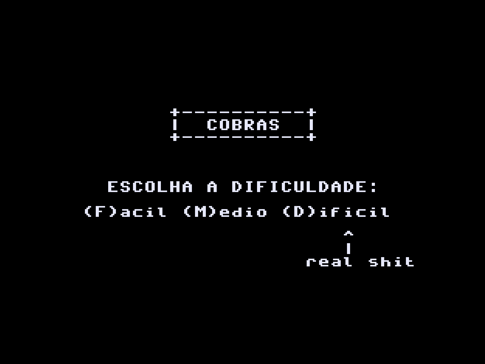
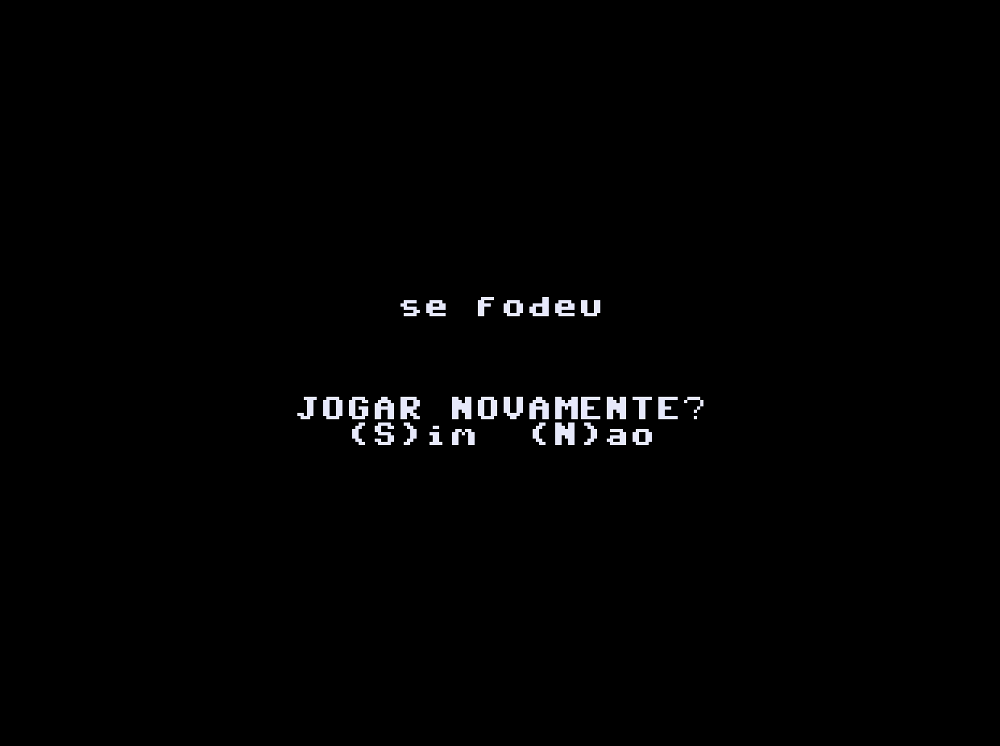
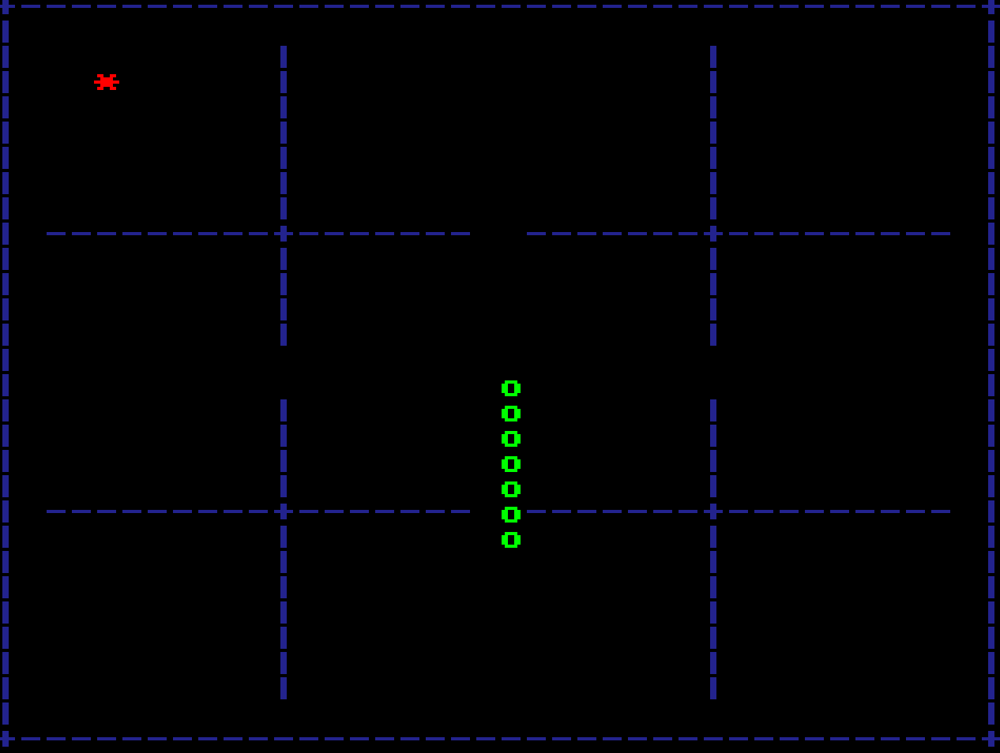

# Minhocuçu

## Trabalho de SSC0119-Pratica-em-Organizacao-de-Computadores

### Grupo:
- 10723919 - Antonio Luiz Carvalho Turano Filho
- 10260462 - Matheus Lopes Rigato
- 10724455 - Yago Poletto Salgado

Este projeto consiste na implementação de um jogo no estilo do clássico Snake
para a disciplina de Prática em Organização de Computadores, bem como as
modificações propostas para o processador mostrado durante as aulas.

## O Jogo

Para executar o jogo, deve-se usar o arquivo "minhocucu.asm" no simulador 
fornecido em aula pelo professor Simões. Ao executar o simulador juntamente 
com o arquivo do jogo (usando a tecla F7 para iniciar), a tela inicial do jogo 
lhe apresenta 3 dificuldades diferentes (Fácil, Médio e Difícil), sendo que a 
melhor de todas é obviamente a difícil ;).



Caso perca, uma tela aparecerá 
perguntando se gostaria de resetar o jogo ou se gostaria de receber uma 
surpresa especial :).



Os controles do minhocuçu (a "cobra"), são WASD para as direções, e o objetivo 
é comer as frutas que são geradas no campo (cuidado para não colidir com 
paredes e obstáculos).



## Modificando o Processador

Seguindo as instruções passadas em aula, modificamos o processador que nos foi
passado para incluir uma nova instrução, a SCORE.

Essa nova instrução foi inicialmente pensada como um possível complemento para
o nosso jogo, e seria responsável por auxiliar no cálculo da pontuação do
jogador para cada fruta comida pelo minhocuçu (a "cobra" do jogo), mas até o
momento, não pensamos em uma efetiva e prática lógica para a contabilização de
pontos.

Portanto, a instrução SCORE está desassociada do jogo, e foi implementada com o
intuito principal de exemplificar uma modificação no processador (a adição de
uma nova instrução).

A instrução SCORE, por sua vez, possui a função de realizar um cálculo
relativamente simples, uma operação de elevar um valor ao quadrado e adicionar
um ao resultado:

```vhd
RESULT32 := (X * X) + 1;
```
